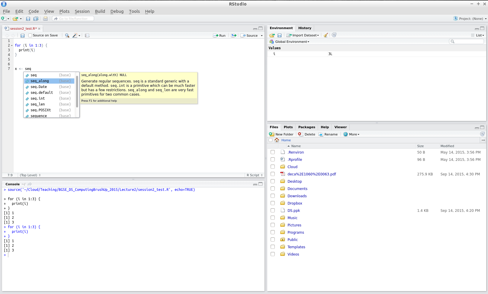

```{r, knitr_options, include=FALSE}
    
    # loading in required packages
    if (!require("knitr")) install.packages("knitr"); library(knitr)
    if (!require("rmarkdown")) install.packages("rmarkdown"); library(rmarkdown)

    # some useful global defaults
    opts_chunk$set(warning=FALSE, message=FALSE, include=TRUE, echo=TRUE, cache=TRUE, cache.comments=FALSE, comment='##')

    # output specific defaults
    output <- opts_knit$get("rmarkdown.pandoc.to")
    if (output=="html") opts_chunk$set(fig.width=10, fig.height=5)
    if (output=="latex") opts_chunk$set(fig.width=6,  fig.height=4, 
        dev = 'cairo_pdf', dev.args=list(family="Arial"))
```


```{r, Setup_and_Loading_Data, echo=FALSE}
   
    # cleaning before starting
    # rm(list=ls())
    # getwd()
    # setwd("/home/hstojic/Teaching/BGSE_DS_ITC_2017/source")

    # rmarkdown::render("handout_Rbasics.Rmd", c("rmarkdown::tufte_handout", "tufterhandout::html_tufte_handout"), clean=TRUE, output_dir = "../handouts")
    # rmarkdown::render("handout_Rbasics.Rmd", c("html_document", "pdf_document"), clean=TRUE, output_dir = "../handouts")

```


# Introduction 

R is the standard programming language and statistical environment in statistics and econometrics research. It is also becoming ubiquitous in the data science departments of the corporate world.^[[KDNuggets poll](bit.ly/1vZVWi0)]

Apart from the R core functions, an active community maintains thousands of packages with specific routines solving a wide range of problems.

This course covers the essential topics to get started in R. It will also refresh your previous knowledge if you are already familiar with it. After the course you should be able to get data, perform basic statistical analyses, and present your results in graphical form.


## General references

- *A (Very) Short Introduction to R*, Paul Torfs & Claudia Brauer, 2014: A 12-page introduction covering the essentials of this brush-up.^[[https://cran.r-project.org/doc/contrib/Torfs+Brauer-Short-R-Intro.pdf](https://cran.r-project.org/doc/contrib/Torfs+Brauer-Short-R-Intro.pdf)]
- *An Introduction to R*, W. N. Venables, D. M. Smith, and the R Core Team, 2014: The canonic introduction to R, with far more detail than strictly needed for this course.^[[https://cran.r-project.org/doc/manuals/R-intro.pdf](https://cran.r-project.org/doc/manuals/R-intro.pdf)]  
- *Introduction to Data Technologies*, P. Murrell, 2013: Useful to see how R integrates in a Data Science workflow. Provides comprehensive examples. See chapters 9 and 10.^[[stat.auckland.ac.nz/~paul/ItDT](stat.auckland.ac.nz/~paul/ItDT)]  
- *Advanced R*, H. Wickham, 2014: Designed primarily for R users who want to improve their programming skills and understanding of the language.^[[adv-r.had.co.nz](adv-r.had.co.nz)]


# Installing R

Download R (for free) from CRAN and install it.^[Available for Windows, Linux, and Mac from [cran.r-project.org/](https://cran.r-project.org/)] Default options are OK. In this official R site you can also download manuals and get help.


# Installing Rstudio

You can run `R` simply by opening a terminal and typing `R`. `R` also includes an interface to see your code, plots, or getting help (called R-GUI). However, it is quite convenient to run `R` through Rstudio. Rstudio is an IDE, integrated development environment. Rstudio allows you to easily code and execute R scripts and is currently the most widely used R environment. It also offers several extra options such as syntax highlighting, indentation, command tooltips, Shiny integration or R-markdown integration.

Of course, you can use any text editor to create R scripts and then run them in the terminal. Some more advanced text editors allow you to run code directly with the help of some additional modules, check for example, Vi, Emacs or Sublime text. If you are only starting with R, I suggest you to use Rstudio, it will facilitate your learning at the beginning quite a bit.

After installing R head to the RStudio [website](www.rstudio.com) and download
the installer for your OS.

When you open Rstudio, you typically have four areas:

1. **Console.** This is the standard `R` console. To execute commands you simply have to enter `R` instructions and type return.

2. **The R script(s) and data view.** This window contains the `R` scripts you have currently opened. Note that you can execute individual lines by placing the cursor over a line and pressing CTRL+return. You can can execute any number of lines by highlighting them an pressing CTRL+return. Finally, you can execute the whole script by pressing SHIFT+CTRL+return.

3. **Workspace and history.** The workspace shows you the list of currently defined variables. If you want to see the content of a variable simply click over it. The content of the variable will be displayed in the data view, while history shows you the history of commands you have typed.

4. **Files, plots, packages and help.**





Rstudio has loads of useful shortcuts that you should explore that allow you to use the environment more efficiently. Among others, I find particularly useful the shortcut CTRL+1 and CTRL+2. CTRL+1 moves the cursor to the script view while CTRL+2 moves the cursor to the console. Another useful shortcut is CTRL+SHIFT+C that comments and uncomments the code. 


# Getting help  

Knowing where and how to get help is an important skill in any programming language. A joke that recently appeared on the web was: "Computer programming should be officially renamed to Googling Stackoverflow"

The most common situation is understanding how a function works. The most direct way to find out is to use the R help files. Just use the `help` function or the `?` shorthand to access these files within RStudio.

```R 
help(length)
?dim
```

If the help files aren't enough, then you might want to try to just search what you're looking for on Google (e.g. "rnorm function R") or the dedicated RSeek.org.^[Since R is such a common expression, sometimes Google cannot interpret it as the name of the language.] One of the greatest features of R is a very dedicated community of users. You'll often find tons of answers to even the most unlikely questions in Stack Overflow or some other Q&A site. But even after getting help you might not find the exact solution you are seeking: you need creativity to program yourself and create and combine functions in a certain way to achieve the desired result.


# Using R 

## The R console

Your first interaction with R can be as simple as using a calculator:
type an arithmetic operation and press `Enter` to get the result

```{r} 
1 + 2
1 - 2
1 / 2
1 * 2
2 ** 3
```

Other mathematical operations are also immediately available, e.g. sinus function or square root

```{r} 
sin(5/2)
sqrt(2)
```

You can assign a value to a named object using the `<-` operator^[`a` being the object, `5` being the value] and pressing `Enter` 

```{r} 
a <- 5
```

Then you can access the object you have created by writing `a` and pressing `Enter` 

```{r} 
a
```

Note that R is case sensitive, so that `a` and `A` are two different objects.


## R scripts

As any other programming language, R is useful when coded. Scripts with code contain the workflow of your analysis (from importing the data to saving plots as pdf's), so you can re-execute it when inputs change, or you can share it. 

Open a new R script in RStudio^[Menu > File > New File > R Script] and save it. Start typing code (the calculations above suffice). Pressing Ctr+Enter ( Cmd+Enter if you're on a Mac) will send to the console the current line. To execute multiple lines select them and again press Ctr+Enter.

It is advisable to write comments within the code. Titles of code sections make it easier to navigate the file, and descriptions of certain tasks are essential when revisiting a code later (or when sharing it with someone else). In R you write non-executable text after the symbol `#`

```R 
## This is an example of commented code (title
## comment)
a <- 1  # a is a parameter (inline comment)
```

The script you have just created (lets call it `script.R`) can be executed by "sourcing" it with a `source` command. That way, everything that a script does (e.g. defines a function or creates a vector with some numbers), can become available in another script.

```R 
source("relative_path/script.R")
source("/absolute_path/script.R")
```

Note that you have to specify the path to the script. Same as in shell, path depends on your current position. You can find your present working directory with `getwd` command and set it to something else with `setwd`.

```R 
getwd()
setwd("/absolute_path/to_some_dir/")
```

In Rstudio, to set the working directory, you can go to tab Session > Set Working Directory.


# Installing & loading packages  

One of R’s most powerful features is the wide array of packages created and maintained to solve particular problems. Some of these packages are variations or improvements of basic routines (e.g. `ggplot2` for `graphics`), others extend the power of R (such as the data base connectors), and some can perform esoteric tasks (such as developments in narrow branches of science). Think of R packages as simply a collection of functions with some additional documentation provided. It is relatively easy to create R packages and you should try it once.

In R it is key to be familiar with some popular packages since they can increase your productivity significantly, but most of all, to be able to find the right tool for the job.

Here we set up an example with the package `dplyr`. This package has useful functions for getting quick summaries on variables in data frames, but for now we are only interested on installing and loading it.

You can install the packages by using command `install.packages` from the `R` console. For example, to install a package `dplyr` that is available on CRAN - an official repository of `R` packages

```R 
install.packages("dplyr")
```

Once you have installed a package you won't have to repeat the installation again in that machine unless you want to update the package. You could also install packages through the RStudio menu, simply click on `install packages` in the package tab and enter the package you want to install. `R` will automatically download it and install it.^[It is a good idea to keep track of the packages you are using and write all their installations explicitly in an R script, so you can install them in another machine easily.]

Some packages are not available on CRAN. These are usually packages that are still in development or perhaps some private packages, for example of your colleague. Usually they are on Github, and in that case `devtools` package provides an easy way to install them via function `install_github`.

```R 
install.packages("devtools")
devtools::install_github("username/branchname")
```

The `::` operator here means use the function `install_github` from `devtools` package without really loading the whole package. There are other ways to install the packages, but for now this will suffice.

Once the package is installed, to use the functions it provides you have to load it via either `library` or `require` command. Both will work, but experts say `library` is a preferred way.

```R 
library(dplyr)
require(dplyr)
```

Note that with these functions you can omit the quotes. Each new R session will require that you reload the package. It is advisable to write in your script instructions for loading the packages and not loading them through the RStudio menu.

Sometimes you may want to unload a package you no longer need in your current session

```R 
detach("package:dplyr")
```


# Data types

Most of the data you deal with will be either **numbers**, **strings**, or **dates**.

The most common types of numbers are `logical` ( 1/0 or TRUE/FALSE ), `integer` (no decimals), and `double` (may include decimals).

Strings are of type `character` and are surrounded by single quotes `'a'` or double quotes `"a"`.

You can use `typeof` function to get their type.

```{r}
typeof(1L)
typeof(2.75)
typeof("1")
typeof(NA)
typeof("NA")
typeof(TRUE)
typeof(NULL)
```

Dates are represented as the number of days since 1970-01-01, with negative values for earlier dates. We will get into them later. You can convert between data types using the `as.` functions (as long as your transformations make sense).

```{r}
# converting between numeric and character
as.character(1)
as.character(2.75)
as.numeric("1")
as.numeric("a")  # Coercion not possible, returns a missing value

# converting between logical and integer
as.integer(TRUE)
as.logical(0)
as.logical(-8.34)

# converting between numeric and integer
as.integer(3.24)
as.numeric(5)
```


# Data structures 

You can categorize data structures according to their dimensionality (1d, 2d, or nd) and whether they can handle data of different types - **homogeneous** where all contents must be of the same type, or **heterogeneous** where the contents can be of different types.

-------------------------------------------------------------------------- 
       Homogeneous                  Heterogeneous
------ ---------------------------- --------------------------------
1d     Atomic vector                List 

2d     Matrix                       Data frame

nd     Array

--------------------------------------------------------------------------

Given an object, the best way to understand what data structures it is, is to use `str` function. It is short for structure and it gives a summary description of any R data structure


## Homogeneous structures

The basic data structure in R is an **atomic vector**, which might contain a
sequence of numbers or a sequence of strings.

```{r}
# Numeric vector
nvec <- c(1, 2, 3)
str(nvec)
class(nvec)
nvec[2]  # access the second element in the vector

# Character vector
svec <- c("a", "b", "c")
str(svec)
class(svec)
svec[3]  # access the third element in the vector

```

Some convenient functions to create vectors

```{r}
1:5
seq(from = 2, to = 10, by = 2)
rep("Char", 3)
```

Internally, scalars (single numbers or a single string) are actually vectors with one element.

In R it is crucial to operate on data structures (and not looping through them, operating element-by-element). For example, vector-oriented arithmetics.

```{r}
2 * nvec
as.character(nvec)
```

Data structures can have attributes, a metadata that describes some crucial characteristic of the data structure. Atomic vectors do not have attributes. 

```{r}
x <- 1:10
attributes(x)
```

Matrices are a two-dimensional generalization of numerical vectors. R has matrix algebra operations.

```{r}
# create a matrix
mat <- matrix(c(nvec, nvec, nvec), ncol = 3)
mat

# transpose a matrix
t(mat) 

# matrices have attributes 
attributes(mat)
```

Matrices are atomic vectors with dim attribute.

```{r}
x <- 1:10
dim(x)

# create a matrix with defining the dim attribute
dim(x) <- c(1,10)   
attributes(x)
class(x)
x
```

Arrays are more complex structures and are beyond the scope of this brush-up.


## Coercion rules

When you mix types in homogeneous structures, elements will be coerced into single type. For example, all elements of an atomic vector must be the same type. 

The rule is that they will be **coerced to the most flexible type**. Types from least to most flexible are: **logical, integer, double, and character**.

```{r}
# combining a character and an integer yields a character
str(c("a", 1))

# a logical vector is coerced to an integer or double, 
# TRUE becomes 1 and FALSE becomes 0
x <- c(FALSE, FALSE, TRUE)
as.numeric(x)
x
```


## Heterogeneous structures

Heterogeneous structures accept different types of data. The two main structures of this kind in R are **lists** and **data frames**.

**Lists** are the most flexible kind of structure. You can collect objects
of different types and lengths, as well as other structures, even other lists themselves.

```{r}
mylist <- list(country = c("Portugal", "Italy",
               "France", "Greece", "Spain"), 
               GDPRange = c(-3.9, 0.2), 
               estimate_type = list("not available", 
                "provisional", "estimated"))
mylist
```

Elements of a list should be named and you can retrieve one of these elements using the syntax `list$element`.

```{r}
names(mylist)
mylist$GDPRange
```

**Data frames** only contain **vectors of the same length** but they may be of different types. Data frames usually have named columns.

```{r}
countries <- data.frame(country = c("Portugal",
                "Italy", "France", "Greece", "Spain"), 
                GDPGrowth = c(-1.4, -1.9, 0.2, -3.9, -1.2), 
                provisionalEst = c(FALSE, FALSE, FALSE, TRUE, FALSE))
countries

# data frame attributes
dim(countries)
names(countries)
```

A single vector from a data frame can be extracted.

```{r}
countries$GDPGrowth
```

Subsetting in data frames uses indices on rows/columns: `[optional rows condition, optional columns condition]`.

```{r}
countries[1, ]
countries[, 2]
countries[countries$GDPGrowth > 0, ]
countries[countries$provisionalEst == FALSE, ]
countries[countries$country %in% 
        c("Portugal", "Italy", "France"), 
        c("country", "GDPGrowth")]
```


## Converting between structures

As with types, you can use `as.` functions to convert between different kinds of data structures (as long as it makes sense):

```{r}
# converting between lists and vectors
as.list(nvec)
list(svec)
as.vector(mylist)
```


# Arithmetics

Arithmetics is important for variable transformations whenever you have numerical variables. Arithmetic operators available in R are also called binary operators. They work on both vectors and matrices. 

-----------------------------------------
Operator    Description
----------  -----------------------------
`+`         addition

`-`         subtraction

`*`         multiplication

`/`         division

`^ or **`   exponentiation

`x %% y`    modulus (x mod y) 5%%2 is 1

`x %/% y`   integer division 5%/%2 is 2 
-----------------------------------------


Matrices have a set of operators that are specific to matrix algebra. Matrix algebra is less important for data manipulation, but is very important for programming machine learning algorithms. There are many other functions for matrix algebra, such as `solve`, `diag`, `eigen` or `svd`, but here I listed the most basic ones.

------------------------------------------------
Operator           Description
-----------------  -----------------------------
`A * B `           Element-wise multiplication

`A %*% B`          Matrix multiplication 

`A %o% B`          Outer product, AB' 

`crossprod(A,B)`   Cross product, A'B

`t(A)`             Transpose
------------------------------------------------


```{r}
y <- matrix(1:12, 3, 4)
y 

# some examples of element-wise calculations
3 * y  
3 / y 
y / 3 
y**3  # this is not a square of a matrix!
3 + y  # this will work as well - BROADCASTING!

# in vector-matrix operations, an atomic vector  
# can be treated both as a row and a column vector
# be careful with this
x <- 1:3
x %*% y  # this is correct, [1 3] [3 4]
#y %*% x  # this will produce an error [3 4] [1 3]

# but here atomic is a column vector
y %*% 1:4  # this is correct, [3 4] [4 1]

# strangely, this would work as well
x * y  # row-wise multiplication - BROADCASTING!
```

Note that matrix algebra in R does not strictly follow the rules of linear algebra, mostly due to its broadcasting feature.


# Random number generators

How can you generate random numbers? You can't really, the only things that are truly random are the measurement of physical phenomena like thermal noise. Though, you can generate pseudo-random numbers, called pseudo because they are generated by a deterministic algorithm that can be repeated. R has quite a big number of random distributions that are shipped with base installation. These functions are available as soon as R console is started.

For example, to generate uniformly distributed random numbers, you would use  `runif` function. 

```{r}
# a single sample, from 0,1 range by default
runif(1)

# get a vector of 4 numbers
runif(4)

# Get a vector of 3 numbers from 0 to 10
runif(3, min = 0, max = 10)

# Get 3 integers from 0 to 10
floor(runif(3, min = 0, max = 11))
```

To generate numbers from a normal distribution, you would use `rnorm`. 

```{r}
# by default the mean is 0 and the standard deviation is 1.
rnorm(4)

# use a different mean and standard deviation
rnorm(4, mean = 5,  sd = 10)

# you can check the distribution by plotting the draws
x <- rnorm(4000, 5, 10)
hist(x, 30)
```

Some of the other distributions present in R by default:  
- 
- Bernoull and Binomial `rbinom`  
- Geometric `rgeom`  
- Poisson `rpois`  
- Beta `rbeta`
- Exponential `rexp`  
- Student `rt`

If you check the help files of either `runif` or `rnorm` you will notice that they come with few other functions starting with letter "p","q" and "d", corresdonding to the cumulative distribution function (CDF), the inverse CDF and the density function (PDF).

For exampl, you could use `pnorm` function to compute the p-value of z-statistic of 2.1

```{r}
# compute two tailed p-value 
2*pnorm(-abs(2.1))
2*pnorm(abs(2.1), lower.tail = FALSE)  # gives the same

```


Another popular function for generating random numbers is `sample` which is convenient when you have a vector of values and you want to sample them according to some probabilites that you specify

```{r}
# generate integers, with replacement
sample(1:10, 10, replace = TRUE)

# To generate letters of the alphabet, without replacement
sample(LETTERS, 3, replace=FALSE)
```

When you are generating random numbers you usually want to ensure that you can repeat the simulation, recreate exactly the same sequence of numbers. You would use `set.seed` for this purpose.

```{r}
set.seed(1234)
runif(5)

# if you run it again without set.seed you get a different sequence
runif(5)

# in case you want to repeat it again...
set.seed(1234)
runif(5)
```


# Control structures 

Until now, all the code we used was sequential: each line of code gets executed after its preceding line, and each line is executed once. But any complex programming project will require more than sequential lines of code - it will require **conditional structures** (execute some code only if something happens), **loops** (execute some code as many times as something happens), and **functions** (execute some code in multiple settings).


## Conditionals

Conditional expressions allow us to execute some parts of our code only if some logical condition holds (and doing something else if that condition doesn't hold).

```R
if (condition) {
    expression
}
```

Here if is the keyword that identifies a conditional expression, the parentheses () enclose the logical condition that must hold, and the brackets {} enclose the expression (a number of code lines) to be run. Say we write a code that depends on an object to have a limited length. For example, averaging the vector exampleVector if it has up to 10 elements. Then, only if this length condition holds, we want the expression to be run:

```{r}
# The conditional expression will run

exampleVector <- seq(1,7,1)

if (length(exampleVector) < 10) {
    meanV <- mean(exampleVector)
}

meanV


# The conditional expression won’t run

exampleVector <- 1:15

if (length(exampleVector) < 10) {
    meanV <- mean(exampleVector)
}

meanV  # We check that the expression didn’t run
```

Brackets are optional when the expression contains a single line of code:

```{r}
if (1 == 1) {
    print("True")
}

# In single-line expressions brackets make no difference
if (1 == 1) print("True") 

# The expression doesn’t get evaluated
if (1 == 2) print("True") 
```

A natural next step is answering: what if we need to execute an-
other expression in the case the condition doesn’t hold? The else
keyword is the answer:

```{r}
x <- 1
if (x == 1) print("True") else print("False")

x <- 2
if (x == 1) print("True") else print("False")
```

Or, with multiline expressions:

```{r}
x <- 1
if (x == 1) {
    print(paste(x, "equals 1?"))
    print("True")
} else {
    print(paste(x, "equals 1?"))
    print("False")
}

x <- 2
if (x == 1) {
    print(paste(x, "equals 1?"))
    print("True")
} else {
    print(paste(x, "equals 1?"))
    print("False")
}
```

Note that else must be written right after the closing if bracket (not in the next line). In case of single-line expressions, else follows the expression.


## Loops

A loop is used to repeatedly run a group of expressions. In general you should strive to write code that operates on whole objects, not performing element-wise operations that you do in loops. But sometimes the only way to recurrently perform a task along a sequence of elements is to loop through them. 

A **for** loop runs expressions a **fixed number of times**.

```R
for (symbol in sequence) {
    expressions
}
```

The keywords are `for` and `in`. The brackets {} enclose the expression (a number of code lines) to be run. The parentheses () enclose the sequence along which the expression will be run. The number of times the loop will run is given by the length of sequence and the identifier of each run is the counter symbol.

```{r}
for (i in 1:5) {
    print(i)
}
```

Again, for single-line expressions brackets are optional

```{r}
for (i in 1:5) print(i)
```

There is keyword `break` that you can use to stop the `for` loop prematurely if some condition is met.

```{r}
for (i in 1:5) {
    if (i==4) break
    print(i)
}
```


A **while** loop runs expressions **until a condition is met**.

```R
while (condition) {
    expressions
}
```

The only keyword here is `while`. The brackets {} enclose the expression (a number of code lines) to be run. The parentheses () a logical conditional that must be met for the expression to run. The expression will run until the condition becomes false - so the expression must have at least a line of code that updates the variables evaluated in the condition

```{r}
i <- 1  # Initialize the variable in the condition

while (i <= 5) {
    print(i)
    i <- i + 1  # Updating the variable in the condition
}
```

**Practice**: looping through data frame columns. Obtain the average of each column in the `mtcars` dataset (loaded automatically when R is started), looping through each of its columns with a for statement. Store the results in a single vector. *Hint*: identify each column with indices, not column names, and use the symbol in the loop condition as the column index.


# Functions  


R has lots of functions available by default (specially statistical functions) and even more more available using specific packages. Any challenging task will require the use of a number of complex functions, even some of them written by yourself.

We already learned how to use several basic R functions that come by default in any R session: `seq` or `rnorm`. We also know how to install and load packages that offer a plethora of extension functions.

But of course, one of the advantages of programming is defining your own functions - because you'll need to solve specific problems not covered by the currently available functions.

In general you should follow a mantra: **Do not repeat yourself!** Whenever you see that you tend to repeat some snippets of code relatively often you should write a function for that, even if it seems a small improvement. This style of writing code improves readability and usability of code. Dividing your code into many functional pieces also helps in debugging your programs as it becomes easier to find the culprit.  


## Writing functions

To write a custom functions you define

```R
name <- function(argument1, argument2, ...) {
    expression
}
```

`name` is the function name (a single word of characters and digits, its first character must be a letter). `function` is the keyword for declaring functions. The parentheses () enclose the function arguments (although you can declare functions with no arguments). `argument1` and `argument2` are the function arguments: parameters you will pass to the function and that represent R objects. The brackets {} enclose the function body ( expression ): a set of code lines to be run each time you call the function.

Importantly, the output of the function is the last statement in the function body. If you want to output more than one object, you have to wrap them in a list or some other structure. You can use a keyword `return` to exactly specify what will be the output of the function. To raise an error within the function you should use `stop` function, or `stopifnot` to stop the execution completely.

After you run the code defining a function it gets stored in the current R session. You can then call the function by

```R
name(argument1 = x, argument2 = y)
```

Where x and y are the values (R objects) you want to pass to the function. Lets see an example where we replicate the `seq` function with the default increment of 1

```{r}
seqReplicated1 <- function(from, to) {
    mysequence <- from:to
}

seqReplicated1(1, 9)  # this will not produce an output
(seqReplicated1(1, 9))  # this will produce an output
```

Note that in the last statement of the function we have stored an output in an object, which is a quiet assignment. This is why running a function itself will not produce an output. However, by enclosing it in () we can force it to display the output. 

Another important bit is that variables defined inside the function are not accessible after the function has been executed. This is because when the function is run it creates a self contained environment and objects created remain in that environment, they are not accessible from the global environment. This is why the following will raise an error.

```R
seqReplicated1(1, 9)  
mysequence  
## Error: object 'mysequence' not found
```

As an another example we will replicate the `seq`, but now with by=2 and setting the default `from` value to 1

```{r}
seqReplicated2 <- function(from = 1, to) {
    sequence <- from  # initialize the vector
    while (max(sequence) < to - 1) {
        # concatenate the next digit at each step
        sequence <- c(sequence, sequence[length(sequence)] + 2)
    }
    return(sequence)
}

(result <- seqReplicated2(to = 10))
(result <- seqReplicated2(2, 10))
```

Note that now when no `from` value is set it defaults to 1. In multi-line body functions it is much clearer if we specify the output with the `return` keyword. 

R is function oriented language and as such it provides many tools for manipulating functions. Functional programming is a more advanced topic and we will not cover it. However, sometimes you might want to use a special type of function, that is also important in functional programming - **closure**. Closures are functions that have a function as an output. Lets see an example for correcting missing values in a dataset.

```{r}
missing_fixer <- function(na_value) {
  function(x) {
    x[x == na_value] <- NA
    x
  }
}
fix_missing_99 <- missing_fixer(-99)
fix_missing_999 <- missing_fixer(-999)

fix_missing_99(c(-99, -999))
fix_missing_999(c(-99, -999))
```

**Practice**: Replicate the seq() function with by as parameter. Check it with the parameters `from=1, to=10, by=3` (it should output a vector with these elements: 1, 4, 7, 10).


## Scoping rules

Scoping is the set of rules that govern how R looks up the value of a symbol. In example below, scoping determines how R goes from the symbol x to its value 10

```R
x <- 10
x
```

There are two types of scoping: **lexical** and **dynamic**. We will discuss only the lexical scoping since it is very related to the function creation. 

As modern guru of R - Hadley Wickham - writes^[I strongly suggest to check section on functions and functional programming in his Advanced R book, freely available on web at [http://adv-r.had.co.nz/](http://adv-r.had.co.nz/)]:

> "Lexical scoping looks up symbol values based on how functions were 
> nested when they were created, not how they are nested when they are 
> called. With lexical scoping, you don't need to know how the function is 
> called to figure out where the value of a variable will be looked up. 
> You just need to look at the function's definition."" 


Check the function below and let us try to predict the output

```{r}
x <- 1
h <- function() {
  y <- 2
  i <- function() {
    z <- 3
    c(x, y, z)
  }
  i()
}

h()
```
Call is irrelevant and what matters is how the functions were defined. If a function does not find an object in its own environment, R will look one level up. In this case function `i` looks for objects `x` and `y` in function `h`, finds `y` there and then continues to one environment up and finds `x`.

Same rule is followed even if the object that is searched for is a function, and not a variable.

```{r}
l <- function(x) x + 1
m <- function() {
  l <- function(x) x * 2
  l(10)
}
m()
```

Another important aspect of lexical scoping is that it determines **where** to look for values, not **when**. R looks for values when the function is run, not when it's created. This means that the output of a function can be different depending on objects outside its environment. For example, if an object the function depends on is changed between when it is created and when it is called, the output will change.

```{r}
f <- function() x
x <- 15
f()

x <- 20
f()
```

The environment is the data structure that powers scoping. It is also a more advanced topic, you should check excellent overview by Hadley Wickham once you get on friendly terms with basic R.^[[adv-r.had.co.nz/Environments.html](http://adv-r.had.co.nz/Environments.html#environments)]


## Everything is a function

> “To understand computations in R, two slogans are helpful:  
> 
> - Everything that exists is an object.
> - Everything that happens is a function call."
>    
> John Chambers


It might not seem like it, but operators like `for`, `+`, `<-` or `[` are functions as well. Some of them are a bit special, called "infix" functions, because they do not accept the arguments in a standard way. However, you can invoke them in a standard format as well by using backticks.

```{r}
1 + 2
`+`(1,2)
```

One very useful usage when working with list, is being able to refer to the `[` operator

```{r}
x <- list(1:3, 4:9, 10:12)
x
sapply(x, `[`, 2)
```


## Documenting your functions

As is often argued, it is a good practice to comment your code, particularly so for functions. It is very useful to go a step further and format your comments in a particular way, using Roxygen rules. Roxygen is package for producing documentation for R packages in an easier manner. Let us see an example of a function I often use.

```R
#' A shortcut for negation of the \%in\% operator. 
#' 
#' Using a negation of \%in\% operator in the standard format produces 
#' less readable code. More natural way of using negation in this 
#' context would be to prepend 'in' with standard negation symbol, '!', 
#' which then results in using shorter and more readable 'x \%!in\% y' 
#' instead of '!(x \%in\% y)'.
#'
#' @param x A data structure whose elements will be checked whether
#' they are also present in data structure \code{y}.
#' @param y A data structure that will be checked whether elements 
#' from \code{x} are present in it.
#' @return A logical vector of equal length as \code{x}, with 
#' element(s) not being present in \code{y} as TRUE. If \code{x} was 
#' a matrix, then the output corresponds to \code{x} 
#' converted to a vector.
#' @export
#' @examples
#' # create some numeric vectors
#' x <- 1:4
#' y <- 3:6
#'
#' # standard form
#' results <- !(x %in% y)
#'
#' # new abbreviated format
#' resultsNew <- x %!in% y
#' all(results == resultsNew)

`%!in%` <- function(x, y) !(`%in%`(x, y))
```

If you comment your functions in this manner, later on it will be extremely easy to create an R package. This is relevant, not because you want to publish an R package, but because it will force you to create more reliable functions, that are much easier to share with your colleagues, and your future self a year from now will be grateful to you for creating well documented code that is easy to understand.


## More on sourcing scripts

A typical workflow when performing complex data analyses cannot be done in a single script of code. It is useful to divide the whole analysis into modules. An example: importing data, exploratory analysis, data manipulation, statistical analysis, numerical and graphical results.

But these several modules are linked: the outputs form a module are inputs of the subsequent module. So a natural way of structuring complex code is having a single code (a master) that calls other scripts for performing specific tasks.

As we already mentioned above, in R you call a script with the function `source`. For example, say you have stored all your functions that you often use in a file named `myFunctions.R`, then you can call it from an R session:

```R
source("myFunctions.R")
```

If the code you need is stored in an online repository you can also specify its URL. This example calls utility functions to read PC-Axis files (the kind of files the Spanish Statistical Bureau, INE, uses for presenting results)

```R
source("http://epidemos.es/epi2/libdemof.R")
```

Sourcing scripts is equivalent to opening the file and executing it, with the difference that you don't see the code. So be cautious and inspect each script before sourcing it. If a script contains functions, they will be stored in the current session; if it loads packages, they will be loaded; if it modifies objects you already have in your session, they will be modified.


# R Programming style guide

Style is essential when sharing code with others, and also helps organizing, detecting errors, and revisiting old code. The standard reference is Google’s R Style Guide^[[http://google-styleguide.googlecode.com/svn/trunk/Rguide.xml](http://google-styleguide.googlecode.com/svn/trunk/Rguide.xml)]. We present some of its guidelines here, you should follow them, but not religiously. If you choose to ignore some of the the guidelines, at least use common sense and be consistent.

- **File names** should end in .R and, of course, be meaningful.  
- **Identifiers**: variableName, FunctionName, kConstantName.  
- **Line length**: maximum 80 characters.  
- **Indentation**: two or four spaces, no tabs.  
- **Spacing**: Place spaces around all binary operators (=, +, -, <-, etc.). Do not place a space before a comma, but always after a comma. Place a space before left parenthesis, except in a function call.  
- **Curly braces**: first on same line, last on own line.  
- **Assignment**: use `<-` , not `=`. Exception: setting function parameters.  
- **Commenting** guidelines: all comments begin with # followed by a space; inline comments need two spaces before the #.


